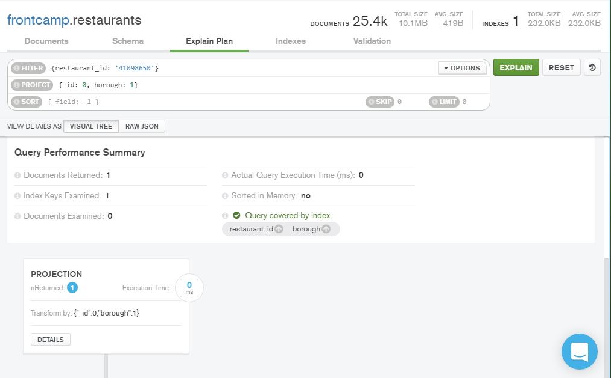
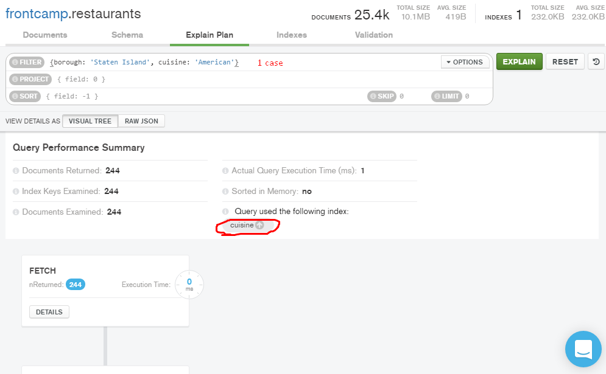
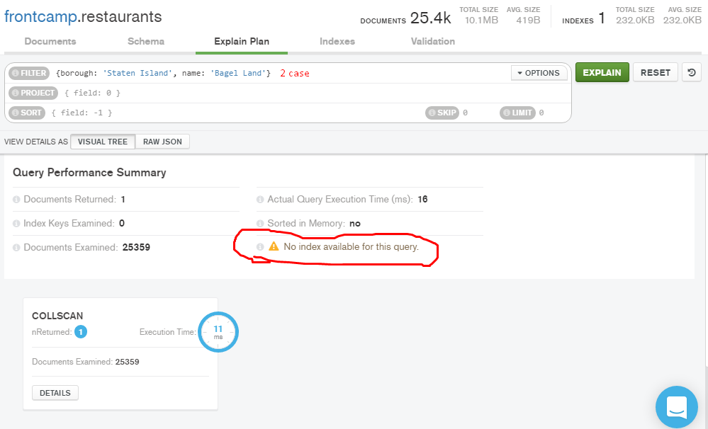
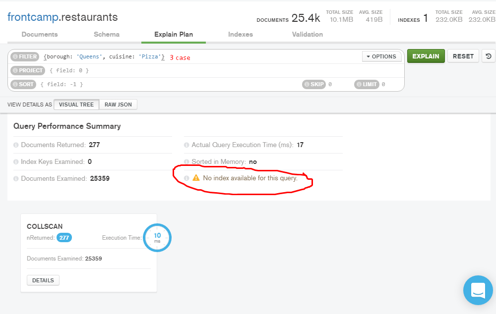
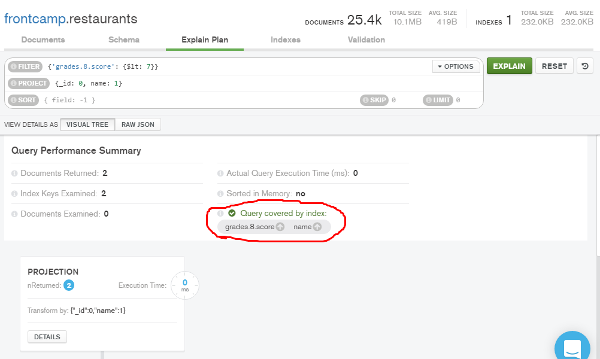

**3.1** db.restaurants.find({cuisine: 'Chinese', borough: 'Queens'}).count()
```json
728
```

**3.2** db.restaurants.aggregate([{$sort:{'grades.score': -1}}, {$limit: 1}, {$project: {'_id': 0, 'restaurant_id': 1}}]) || db.restaurants.find().sort({'grades.score': -1}).limit(1) - the whole object</br>
```json
{ "restaurant_id" : "40372466" }
```

**3.3** db.restaurants.update({borough: 'Manhattan'}, {$push: {grades: {grade: 'A', score: 7, date: ISODate()}}}, {multi: true})
```json
WriteResult({ "nMatched" : 10259, "nUpserted" : 0, "nModified" : 10259 })
```

**3.4** db.restaurants.find({"grades.8.score": {$lt: 7}}, {_id: 0, name: 1})
```json
{ "name" : "Silver Krust West Indian Restaurant" }
{ "name" : "Pure Food" }
```	

**3.5** db.restaurants.find({grades: {$elemMatch: {grade: 'B', date: {$gte: ISODate("2014-02-01T00:00:00.0Z"), $lt: ISODate("2014-03-01T00:00:00.0Z")}}}, cuisine: 'Seafood'}, {_id: 0, restaurant_id: 1, borough: 1})
```json
{ "borough" : "Bronx", "restaurant_id" : "41587617" }
{ "borough" : "Manhattan", "restaurant_id" : "41611969" }
```

**4.1** db.restaurants.createIndex({ name: 1 }), db.restaurants.explain().find({name: 'Glorious Food'})
```json
	{
        "queryPlanner" : {
                "plannerVersion" : 1,
                "namespace" : "frontcamp.restaurants",
                "indexFilterSet" : false,
                "parsedQuery" : {
                        "name" : {
                                "$eq" : "Glorious Food"
                        }
                },
                "winningPlan" : {
                        "stage" : "FETCH",
                        "inputStage" : {
                                "stage" : "IXSCAN",
                                "keyPattern" : {
                                        "name" : 1
                                },
                                "indexName" : "name",
                                "isMultiKey" : false,
                                "multiKeyPaths" : {
                                        "name" : [ ]
                                },
                                "isUnique" : false,
                                "isSparse" : false,
                                "isPartial" : false,
                                "indexVersion" : 2,
                                "direction" : "forward",
                                "indexBounds" : {
                                        "name" : [
                                                "[\"Glorious Food\", \"Glorious Food\"]"
                                        ]
                                }
                        }
                },
                "rejectedPlans" : [ ]
        },
        "ok" : 1
}
```

**4.2** db.restaurants.dropIndex('name_1')</br>
```json
{ "nIndexesWas" : 2, "ok" : 1 }
```	

**4.3** db.restaurants.createIndex({ restaurant_id: 1, borough: 1 }), db.restaurants.explain().find({restaurant_id: '41098650'}, {_id: 0, borough: 1})
```json
{
        "queryPlanner" : {
                "plannerVersion" : 1,
                "namespace" : "frontcamp.restaurants",
                "indexFilterSet" : false,
                "parsedQuery" : {
                        "restaurant_id" : {
                                "$eq" : "41098650"
                        }
                },
                "winningPlan" : {
                        "stage" : "PROJECTION",
                        "transformBy" : {
                                "_id" : 0,
                                "borough" : 1
                        },
                        "inputStage" : {
                                "stage" : "IXSCAN",
                                "keyPattern" : {
                                        "restaurant_id" : 1,
                                        "borough" : 1
                                },
                                "indexName" : "restaurant_id_1_borough_1",
                                "isMultiKey" : false,
                                "multiKeyPaths" : {
                                        "restaurant_id" : [ ],
                                        "borough" : [ ]
                                },
                                "isUnique" : false,
                                "isSparse" : false,
                                "isPartial" : false,
                                "indexVersion" : 2,
                                "direction" : "forward",
                                "indexBounds" : {
                                        "restaurant_id" : [
                                                "[\"41098650\", \"41098650\"]"
                                        ],
                                        "borough" : [
                                                "[MinKey, MaxKey]"
                                        ]
                                }
                        }
                },
                "rejectedPlans" : [ ]
        },
        "ok" : 1
}
```	
 

**4.4** db.restaurants.createIndex({cuisine: 1}, {partialFilterExpression: {borough: {$eq: 'Staten Island'}}})
 
 
 

**4.5** db.restaurants.createIndex({"grades.8.score": 1, name: 1})
 
